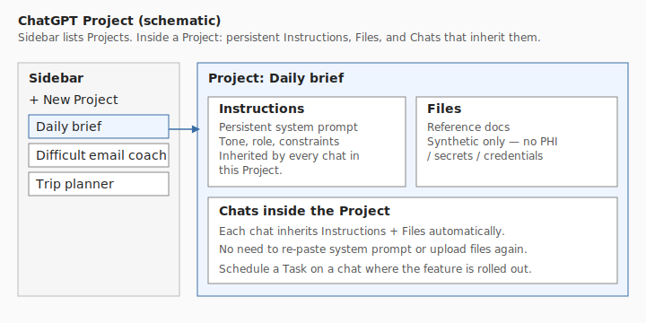
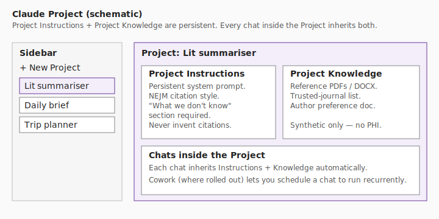
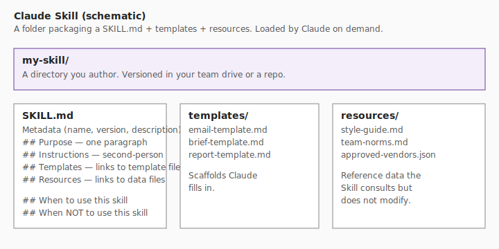
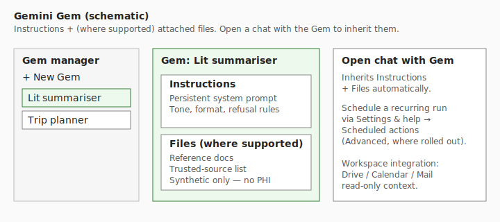
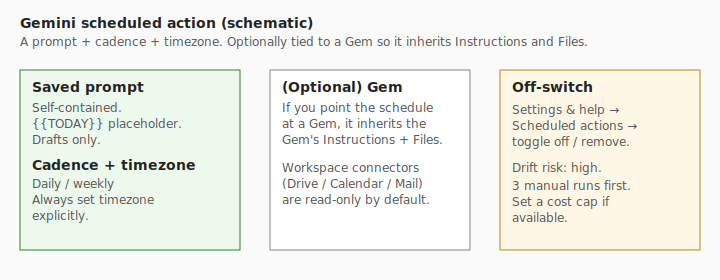
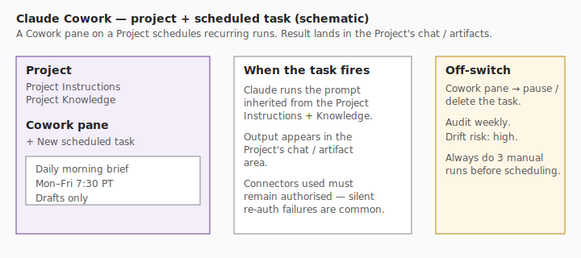
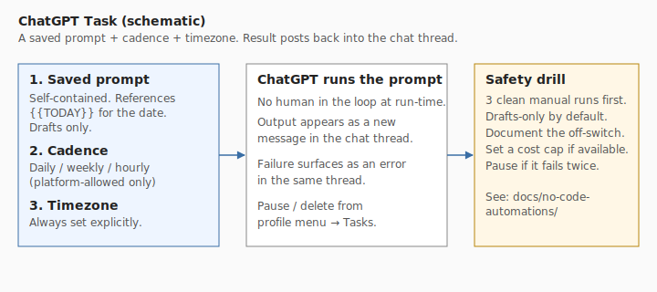
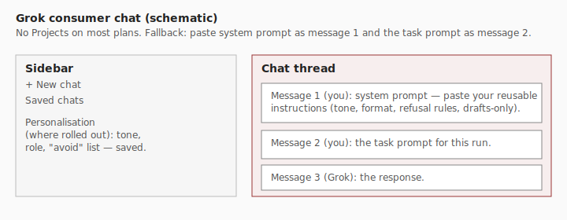

# Plain-English glossary

> **Last verified:** 2026-05-06 · **Drift risk:** low

Short, plain definitions for the AI words this site uses. Each term answers two questions: *what is it?* and *what do I click in my AI?*

If you want the longer technical glossary, see [Glossary](glossary.md).

> **Note on screenshots.** The diagrams below are clean schematic SVGs, not real screenshots, because real screenshots drift fast and risk leaking auth state. Each diagram is labelled "schematic." Future screenshot capture is tracked as a TODO.

## API key

A long string the AI lets a script use to talk to it programmatically.

- **You almost certainly don't need one.** This site only recommends API keys in Developer Mode.
- If you do use one, treat it like a password.
- Free fallback: stay in the chat product. Subscriptions cover almost every use case.

## CLI

"Command-line interface" — a text-based way to use a program in a terminal.

- Examples: Claude Code, Codex CLI, Gemini CLI.
- **You almost certainly don't need one.** This site only recommends CLIs in Developer Mode.

## Project

A reusable workspace inside your AI that holds **persistent instructions** and **uploaded files**. Every chat inside the Project inherits both.

- Where to click:
    - **ChatGPT**: sidebar → New Project.
    - **Claude**: sidebar → Projects → New.
    - **Gemini**: closest equivalent is a Gem.
    - **Perplexity**: closest equivalent is a Space.
    - **Grok / Other**: usually no Project; fallback = pin one chat per topic.

## Skill

A folder containing a `SKILL.md` plus templates and reference files. The AI reads the Skill on demand.

- Today this is most fully developed in **Claude Skills**.
- ChatGPT's closest analogue: a Custom GPT with Knowledge files.
- Gemini's closest analogue: a Gem with attached files.
- Where to click (Claude): write a `SKILL.md` in your team drive or repo.

## Agent

An AI that **takes multi-step actions** with some autonomy — opening tabs, running tools, editing files — toward a goal.

- This site treats agents as a **late** step. The first step is always a saved prompt and a Project.
- All agent recommendations on this site are drafts-only by default; humans send / push / pay / delete.

## Automation

Something that runs **without you triggering it each time** — a daily morning brief, a weekly research watch.

- This site distinguishes **native automations** (scheduled actions inside ChatGPT / Gemini / Claude) from **developer automations** (cron, GitHub Actions, scripts).
- Read the [No-code automation guide](no-code-automations/index.md) before scheduling anything.

## Memory

The AI's persistent knowledge about you across chats — your role, tone, constraints.

- Where to click:
    - **ChatGPT**: Settings → Personalization → Memory.
    - **Claude**: top-right → Profile preferences.
    - **Gemini**: Settings → Saved info.
    - **Grok**: Settings → Personalization (where rolled out).
    - **Perplexity**: Settings → Profile + AI tone.
    - **Other**: keep a [portable AI profile](preferences-memory/index.md#portable-ai-profile) in a notes file.

## Custom GPT

ChatGPT's named, reusable assistant. Has Instructions, Knowledge files, optional Capabilities (Browsing, Code Interpreter), optional Actions (API calls).

- Build at `chatgpt.com/gpts/editor`.
- Can be private, link-shared, or public.

## Gem

Gemini's named, reusable assistant. Has Instructions and (where supported) attached files.

- Build in the Gem manager.

## Cowork

Claude's mode that lets a Project run scheduled, recurring tasks (where rolled out). The output lands in the Project.

## Connector

A **read or read/write integration** between your AI and another product (Email, Calendar, Drive, Slack).

- This site recommends **read-only** connectors by default and drafts-only authority for any action a connector enables.
- A connector that requires re-auth is a common silent-failure cause of scheduled tasks.

## MCP

"Model Context Protocol" — a standard for letting AI clients talk to tools / servers.

- **You almost certainly don't need to write or run an MCP server.** This site only recommends MCP in Developer Mode.
- If you do, see [MCP](mcp/index.md).

## Task / Scheduled action

A saved prompt that runs on a schedule inside the AI app, with the result posting back into the chat.

- ChatGPT: Tasks (where rolled out).
- Gemini: Scheduled actions (Advanced, where rolled out).
- Claude: Cowork tasks (where rolled out).

## Grok chat

The default Grok consumer surface — chat threads on grok.com or in the X app. No Projects on most plans; the universal pattern is to paste a system prompt as message 1 and the task prompt as message 2.

## See also

- [Glossary](glossary.md) — the longer version with technical detail.
- [Capability map](capability-map/index.md) — which products offer each of these.
- [Memory and preferences](preferences-memory/index.md) — practical patterns for global vs project memory.
- [No-code automations](no-code-automations/index.md) — when and how to use Tasks / Scheduled actions / Cowork.

## Future screenshot capture (TODO)

Real annotated screenshots have a high drift risk and a small auth/PHI risk if captured carelessly. Scheduled for a future Visual aids pass:

- Real ChatGPT Project pane with redactions.
- Real Claude Project + Cowork pane with redactions.
- Real Gemini Gem manager + scheduled actions pane with redactions.
- Real Grok chat with personalisation panel.
- Real Perplexity Space with sources panel.
